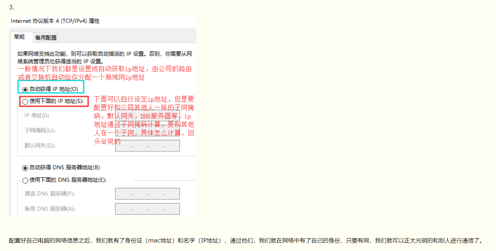
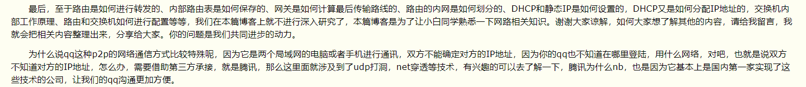

# 网络通信的整个流程
##### 一 、客户端\服务端架构(哪里用到了网络通信)

##### 二 、网络通信的整个流程





##### 三 、DNS服务器


##### 四 、交换机、路由器和网关(含DHCP)

```
假设你的名字叫小不点，你住在一个大院子里，你的邻居有很多小伙伴，在门口传达室还有个看大门的李大爷，李大爷就是你的网关。当你想跟院子里的某个小伙伴玩，只要你在院子里大喊一声他的名字，他听到了就会回应你，并且跑出来跟你玩。

　　但是你不被允许走出大门，你想与外界发生的一切联系，都必须由门口的李大爷（网关）用电话帮助你联系。假如你想找你的同学小明聊天，小明家住在很远的另外一个院子里，他家的院子里也有一个看门的王大爷（小明的网关）。但是你不知道小明家的电话号码，不过你的班主任老师有一份你们班全体同学的名单和电话号码对照表，你的老师就是你的DNS服务器。于是你在家里拨通了门口李大爷的电话，有了下面的对话：

　　小不点：李大爷，我想找班主任查一下小明的电话号码行吗？

　　李大爷：好，你等着。（接着李大爷给你的班主任挂了一个电话，问清楚了小明的电话）问到了，他家的号码是211.99.99.99

　　小不点：太好了！李大爷，我想找小明，你再帮我联系一下小明吧。

　　李大爷：没问题。（接着李大爷向电话局发出了请求接通小明家电话的请求，最后一关当然是被转接到了小明家那个院子的王大爷那里，然后王大爷把电话给转到小明家）

　　就这样你和小明取得了联系。
```

```
二层交换机、三层交换机、四层交换机:
第二层交换机，是根据第二层数据链路层的MAC地址和通过站表选择路由来完成端到端的数据交换的。
二层交换机具体的工作流程如下：
（1） 当交换机从某个端口收到一个数据包，它先读取帧头中的源MAC地址，并将MAC地址与源端口做对应存储在站表中。
（2） 再去读取帧头中的目的MAC地址，并在地址表中查找相应的端口；
（3） 如表中有与这目的MAC地址对应的端口，把数据包直接复制到这端口上；
（4） 如表中找不到相应的端口则把数据包广播到同一VLAN下的所有端口，当目的机器对源机器回应时，交换机又可以学习一目的MAC地址与哪个端口对应，在下次传送数据时就不再需要对所有端口进行广播了。
不断的循环这个过程，对于全网的MAC地址信息都可以学习到，二层交换机就是这样建立和维护它自己的地址表。
    因为站表的建立与维护是由交换机自动完成，而路由器又是属于第三层设备，其寻址过程是根据IP地址寻址和通过路由表与路由协议产生的。所以，第二层交换机的最大好处是数据传输速度快，因为它只须识别数据帧中的MAC地址，而直接根据MAC地址产生选择转发端口的算法又十分简单，非常便于采用ASIC专用芯片实现。显然，第二层交换机的解决方案，实际上是一个“处处交换”的廉价方案，虽然该方案也能划分子网、限制广播、建立VLAN，但它的控制能力较小、灵活性不够，也无法控制各信息点的流量，缺乏方便实用的路由功能。

第三层交换机，是直接根据第三层网络层IP地址来完成端到端的数据交换的。
三层交换机的工作原理：
    使用IP的设备A------------------------三层交换机------------------------使用IP的设备B
    比如A要给B发送数据，已知目的IP，那么A就用子网掩码取得网络地址，判断目的IP是否与自己在同一网段。
    如果在同一网段，但不知道转发数据所需的MAC地址，A就发送一个ARP请求，B返回其MAC地址，A用此MAC封装数据包并发送给交换机，交换机起用二层交换模块，查找MAC地址表，将数据包转发到相应的端口。
    如果目的IP地址显示不是同一网段的，那么A要实现和B的通讯，在流缓存条目中没有对应MAC地址条目，就将第一个正常数据包发送向一个缺省网关，这个缺省网关一般在操作系统中已经设好，对应第三层路由模块，所以可见对于不是同一子网的数据，最先在MAC表中放的是缺省网关的MAC地址；然后就由三层模块接收到此数据包，查询路由表以确定到达B的路由，将构造一个新的帧头，其中以缺省网关的MAC地址为源MAC地址，以主机B的MAC地址为目的MAC地址。通过一定的识别触发机制，确立主机A与B的MAC地址及转发端口的对应关系，并记录进流缓存条目表，以后的A到B的数据，就直接交由二层交换模块完成。这就通常所说的一次路由多次转发。
表面上看，第三层交换机是第二层交换器与路由器的合二而一，然而这种结合并非简单的物理结合，而是各取所长的逻辑结合。其重要表现是，当某一信息源的第一个数据流进行第三层交换后，其中的路由系统将会产生一个MAC地址与IP地址的映射表，并将该表存储起来，当同一信息源的后续数据流再次进入交换环境时，交换机将根据第一次产生并保存的地址映射表，直接从第二层由源地址传输到目的地址，不再经过第三路由系统处理，从而消除了路由选择时造成的网络延迟，提高了数据包的转发效率，解决了网间传输信息时路由产生的速率瓶颈。所以说，第三层交换机既可完成第二层交换机的端口交换功能，又可完成部分路由器的路由功能。即第三层交换机的交换机方案，实际上是一个能够支持多层次动态集成的解决方案，虽然这种多层次动态集成功能在某些程度上也能由传统路由器和第二层交换机搭载完成，但这种搭载方案与采用三层交换机相比，不仅需要更多的设备配置、占用更大的空间、设计更多的布线和花费更高的成本，而且数据传输性能也要差得多，因为在海量数据传输中，搭载方案中的路由器无法克服路由传输速率瓶颈。

第四层交换机
    显然，第二层交换机和第三层交换机都是基于端口地址的端到端的交换过程，虽然这种基于MAC地址和IP地址的交换机技术，能够极大地提高各节点之间的数据传输率，但却无法根据端口主机的应用需求来自主确定或动态限制端口的交换过程和数据流量，即缺乏第四层智能应用交换需求。第四层交换机不仅可以完成端到端交换，还能根据端口主机的应用特点，确定或限制它的交换流量。简单地说，第四层交换机是基于传输层数据包的交换过程的，是一类基于TCP/IP协议应用层的用户应用交换需求的新型局域网交换机。第四层交换机支持TCP/UDP第四层以下的所有协议，可识别至少80个字节的数据包包头长度，可根据TCP/UDP端口号来区分数据包的应用类型，从而实现应用层的访问控制和服务质量保证。所以，与其说第四层交换机是硬件网络设备，还不如说它是软件网络管理系统。也就是说，第四层交换机是一类以软件技术为主，以硬件技术为辅的网络管理交换设备。
最后值得指出的是，某些人在不同程度上还存在一些模糊概念，认为所谓第四层交换机实际上就是在第三层交换机上增加了具有通过辨别第四层协议端口的能力，仅在第三层交换机上增加了一些增值软件罢了，因而并非工作在传输层，而是仍然在第三层上进行交换操作，只不过是对第三层交换更加敏感而已，从根本上否定第四层交换的关键技术与作用。我们知道，数据包的第二层IEEE802.1P字段或第三层IPToS字段可以用于区分数据包本身的优先级，我们说第四层交换机基于第四层数据包交换，这是说它可以根据第四层TCP/UDP端口号来分析数据包应用类型，即第四层交换机不仅完全具备第三层交换机的所有交换功能和性能，还能支持第三层交换机不可能拥有的网络流量和服务质量控制的智能型功能。
重要技术
    如上所述，第二层交换设备是依赖于MAC地址和802.1Q协议的VLAN标签信息来完成链路层交换过程的，第三层交换/路由设备则是将IP地址信息用于网络路径选择来完成交换过程的，第四层交换设备则是用传输层数据包的包头信息来帮助信息交换和传输处理的。也就是说，第四层交换机的交换信息所描述的具体内容，实质上是一个包含在每个IP包中的所有协议或进程，如用于Web传输的HTTP，用于文件传输的FTP，用于终端通信的Telnet，用于安全通信的SSL等协议。这样，在一个IP网络里，普遍使用的第四层交换协议，其实就是TCP（用于基于连接的对话，例如FTP）和UDP（用基于无连接的通信，例如SNMP或SMTP）这两个协议。
    由于TCP和UDP数据包的包头不仅包括了“端口号”这个域，它还指明了正在传输的数据包是什么类型的网络数据，使用这种与特定应用有关的信息（端口号），就可以完成大量与网络数据及信息传输和交换相关的质量服务，其中最值得说明的是如下五项重要应用技术，因为它们是第四层交换机普遍采用的主要技术。
```

##### 五 、总结及其他一些内容简介
